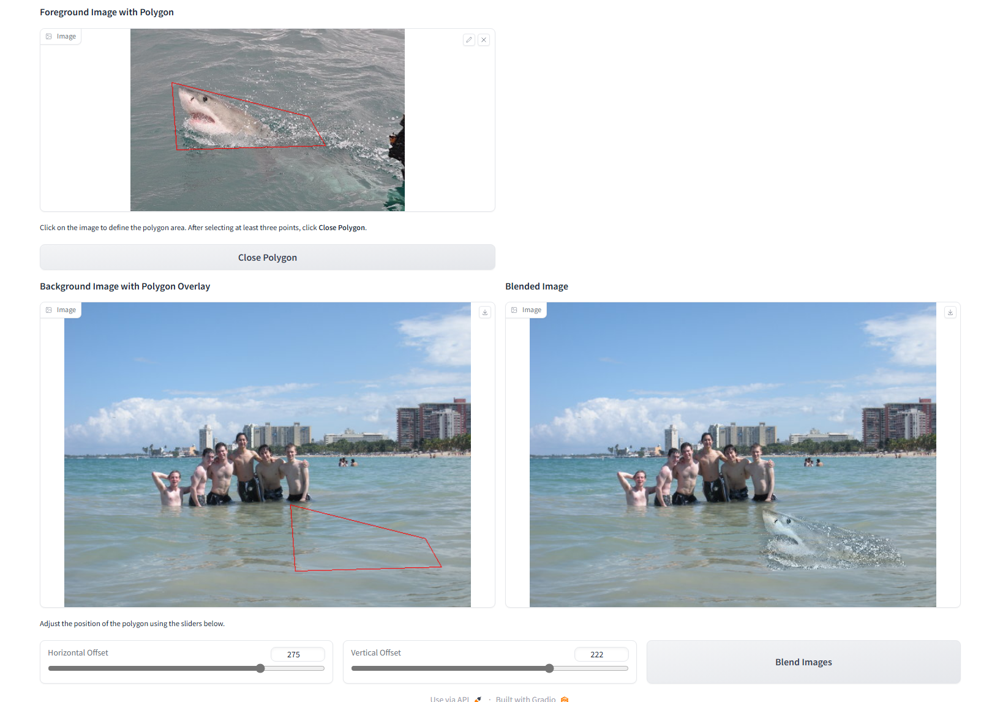
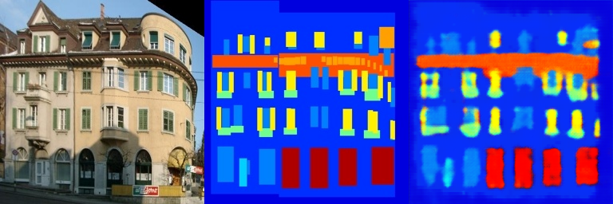
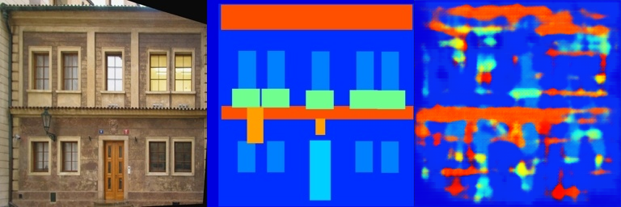

# Assignment 2 - DIP with PyTorch

### This is 肖健楠's impletation of DIP assignment2

### Resources:
- [Assignment Slides](https://rec.ustc.edu.cn/share/705bfa50-6e53-11ef-b955-bb76c0fede49)  
- [Paper: Poisson Image Editing](https://www.cs.jhu.edu/~misha/Fall07/Papers/Perez03.pdf)
- [Paper: Image-to-Image Translation with Conditional Adversarial Nets](https://phillipi.github.io/pix2pix/)
- [Paper: Fully Convolutional Networks for Semantic Segmentation](https://arxiv.org/abs/1411.4038)
- [PyTorch Installation & Docs](https://pytorch.org/)

---

## Requirements
To install requirements:

```setup
python -m pip install -r requirements.txt
```

## Running

To run data poission, run:

```basic
python run_blending_gradio.py
```

To run Pix2Pix training, run:

```point
python train.py
```

## Results
### data poission


### Pix2Pix
#### train result:


#### val result:
