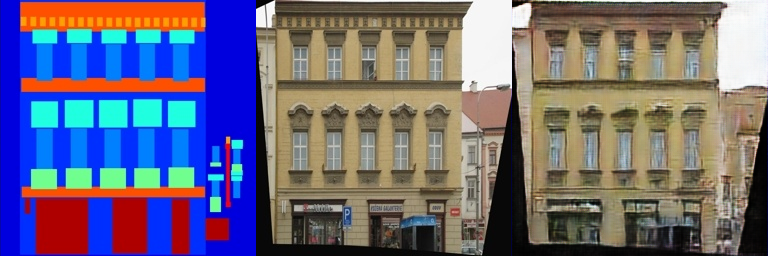
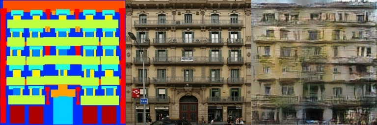

# Assignment 3 - Play with GANs

### This is 肖健楠's impletation of DIP assignment3

### Resources:
- [DragGAN](https://vcai.mpi-inf.mpg.de/projects/DragGAN/): [Implementaion 1](https://github.com/XingangPan/DragGAN) & [Implementaion 2](https://github.com/OpenGVLab/DragGAN)
- [Facial Landmarks Detection](https://github.com/1adrianb/face-alignment)

---
## Requirements

### GAN for facades

In 1 directory

```setup
python -m pip install -r requirements.txt
```

download facades dataset

```dataset
sh 1.sh
```

To run training

```train
python train.py
```

### DragGAN + face alignment
In 2 directory

To prepare DragGAN

```DragGAN
git clone https://github.com/XingangPan/DragGAN.git
cd DragGAN
conda env create -f environment.yml
conda activate stylegan3
pip install -r requirements.txt
```

To download pretrained model

```
python scripts/download_model.py
```

To prepare face alignment

```face alignment
pip install face_alignment
```

Then copy the files and directory under 2 to DragGAN root dir and replace all files

To run DragGAN+face_alignment

```run
scripts/gui.sh
```

## Results

### GAN for facades
#### train results
  

#### val results


### DragGAN + face alignment


https://github.com/user-attachments/assets/9c5004d9-7ac7-4c9f-9bc5-5f3a06261a0a

